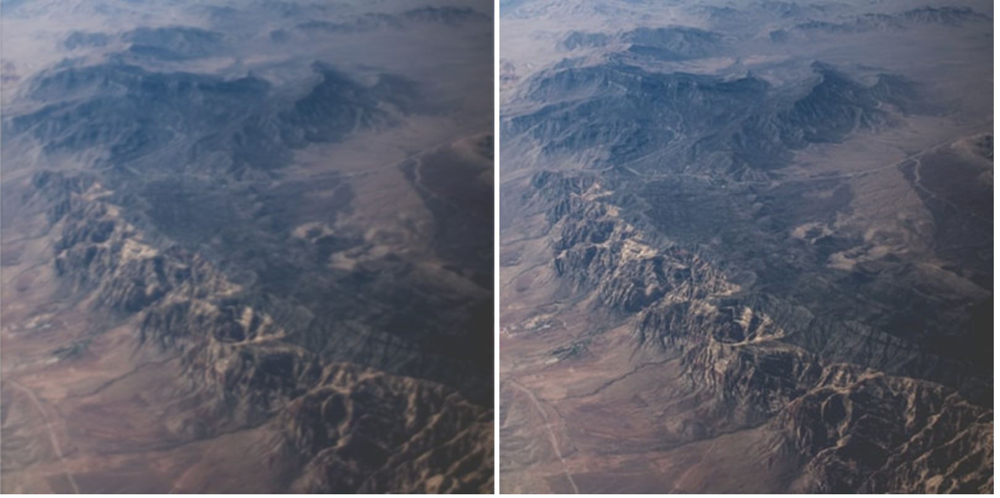

# Image Processing Blur




```javascript
position=(x+y*imageData.width)*4;
imageData.data[position] = c%255;
imageData.data[position+1] = c%255;
imageData.data[position+2] = c%255
imageData.data[position+3] = 255;
```

```javascript
// spits out a long list of values, with quadruples of red, green, blue and alpha channels
imageData.data[]
// [r, g, b, a, r, g, b, a, r, g, b, a…]
```

```javascript
// first two lines of an image
0   1  2  3  4  5
6   7  8  9 10 11
12 13 14 15 16 17

// we can now derive this useful formula from this observation
// to find a specific pixel, this formula has to be used
x + y * width
4 + 12 * 6
= 16

(x + 1 * width) * 4
```

Good resources:

1. https://developer.mozilla.org/en-US/docs/Web/API/Canvas_API/Tutorial/Pixel_manipulation_with_canvas
2. https://www.youtube.com/watch?v=nMUMZ5YRxHI
3. https://www.youtube.com/watch?v=rNqaw8LT2ZU
